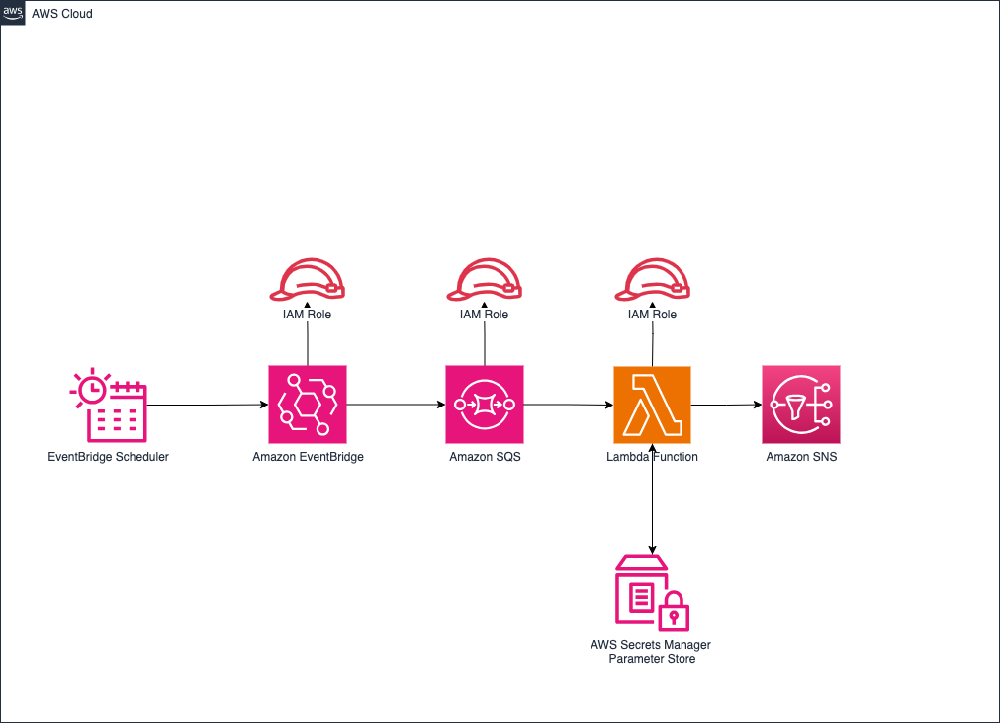

# Weather Client

A lightweight weather API call application written in Python that calls external API to retrieve current weather conditions for a provided location.

## Architecture Diagram



## Environment Setup

To run this project, you will need to add the following environment variables to your .env or .tfvars file

`api_access_key_value`
`aws_region`

See below for prerequisite setup not provided in within provided Terraform

Setup Terraform Cloud with VCS/Git workflow: https://developer.hashicorp.com/terraform/tutorials/cloud-get-started/cloud-sign-up 

Sign up for free weather API account: https://weatherstack.com/signup


## Deployment

First create role with access to provision resources in your AWS accrount using terraform files in path ./aws/trust set variables accordingly.

Once variables are setup run below to create role for Terraform for use with OpenID for temporary, role based authentication to AWS

```bash
  terraform init
```

```bash
  terraform plan
```

```bash
  terraform apply
```

## Tech Stack

**Client:** Python

**Server:** Serverless Compute

## Lessons Learned

What did you learn while building this project? What challenges did you face and how did you overcome them?


## Authors

- [@xrmashiloane](https://www.github.com/xrmashiloane)


## License

This library is licensed under the MIT-0 License. See the [LICENSE](LICENSE) file.